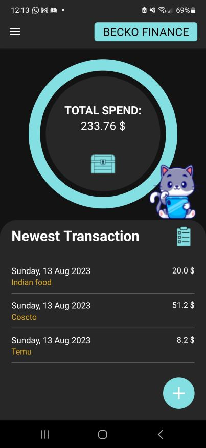
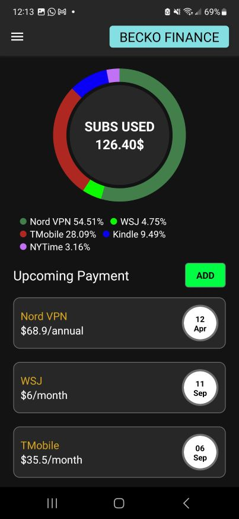
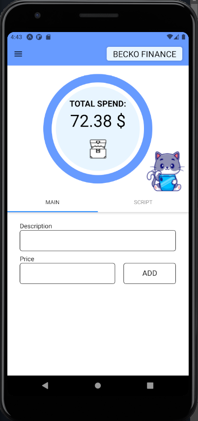

# Mobile Application: FinApp
An application to track monthly expenses on any daily purchases and monthly subscriptions. Inspired by the book "Rich Dad Poor Dad", I created this application with features that are customized to my need. So far this application has helped me actively keep track of my expenses and help me grow financially in savings.

    

## Implementation
### Tech Stack
Software:
- **React Native, CSS** *frontend and general website layout*
- **JavaScript** *general app functionality*
- **NodeJS and Express** *backend, REST API, and live server*
- **MongoDB** *Database*
  
### Deployment
- **EXPO EAS** *Using EAS Build to create Android APK*
- **Heroku** *Using Heroku remote repository to enable live server*
- **MongoDB Atlas** *Using multi-cloud database service to store data*

### Design Inspiration
**LINK** - https://xd.adobe.com/embed/827c51be-8cfe-459a-9257-78f4b08b9893-d72f/

